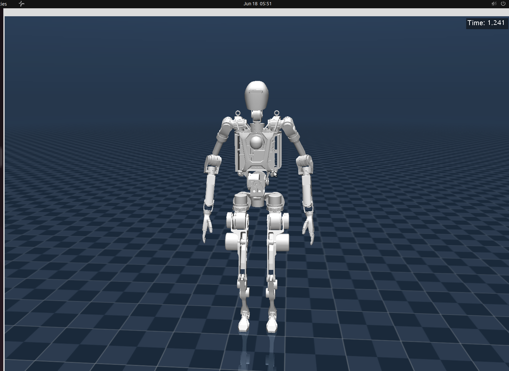

# OpenLoong Dynamics Control

## 基于 MPC 与 WBC 的仿人机器人运动控制框架

欢迎访问 🐉 OpenLoong 开源项目代码仓库！

OpenLoong开源项目是由人形机器人（上海）有限公司、上海人形机器人制造业创新中心与开放原子开源基金会（OpenAtom Foundation）共同运营的开源项目。本仓库提供了一套基于 MPC 与 WBC 的仿人机器人控制框架，可部署在 Mujoco 仿真平台上。基于上海人形机器人创新中心“青龙”机器人模型，提供[行走](https://atomgit.com/openloong/openloong-dyn-control/blob/master/demo/walk_wbc.cpp)、[跳跃](https://atomgit.com/openloong/openloong-dyn-control/blob/master/demo/jump_mpc.cpp)、[盲踩障碍物](https://atomgit.com/openloong/openloong-dyn-control/blob/master/demo/walk_mpc_wbc.cpp)三种运动示例，在实物样机上实现了机器人的<b>行走</b>、<b>盲踩障碍</b>两种运动。

## 项目特点

- **易部署** 提供全面的代码运行环境部署解决方案，以便用户能够轻松配置其所需的工作环境，本代码仓库包含了主要依赖，无需进行众多第三方库的安装，简化整个部署过程。

- **可扩展** 控制框架结构采用分层模块化设计，旨在提高系统的可维护性和可扩展性，系统各功能模块在逻辑和功能上具有明确的界限，为二次开发提供了更加友好的环境，使开发人员能够更轻松地对系统进行功能定制和扩展。

- **易理解** 代码结构简洁，遵循针对功能进行模块封装的代码设计原则，应用总线进行模块间数据交互，减少封装冗余，有助于降低代码复杂度；算法实现采用“读取-计算-写入”的简单逻辑，提高代码的可理解性。

  <center></center>

## 更新日志

2024.06.29

1. 增加walk_wbc_joystick与 walk_mpc_wbc_joystick两个demo，可利用键盘控制机器人运动，并能实现转弯。

2024.08.12

1. 修改由mujoco中提取传感器数据的ID错误，感谢驯龙软件对该问题的提出；
2. 修改MPC中c矩阵定义的维数错误，感谢@geekloong、@yichuanku对该问题的提出；
3. 修改WBC优先级计算中，第一个优先级的计算错误，感谢@1190201119对该问题的提出；
4. 修改MPC的代价函数。

2024.09.11

1. 增加低阻尼模型分支“low_damping_model”，该模型与实物样机的关节响应基本一致，提供walk_wbc_joystick与 walk_mpc_wbc_joystick两个demo；
2. 增加**更换模型**说明文档[Tutorial](https://atomgit.com/openloong/openloong-dyn-control/blob/master/Tutorial.md)。

## 环境安装

**环境建议**

- 操作系统：Ubuntu 22.04.4 LTS
- 编译器：g++ 11.4.0

**依赖安装**

本仓库为基于 mujoco 针对“青龙”人形机器人进行制仿真测试， mujoco 的仿真引擎、pinocchio 动力学库、eigen、quill 记录工具、GLFW 图形库、jsoncpp 解析库等也包含到了仓库之中，但仿真界面需系统支持 openGL，需安装

```Bash
# Update & Install Dependencies
sudo apt-get update
sudo apt install git cmake gcc-11 g++-11
sudo apt install libglu1-mesa-dev freeglut3-dev
```

## 使用指南

**代码获取与编译**

```Bash
# Clone
git clone https://atomgit.com/openloong/openloong-dyn-control.git

# Build
cd openloong-dyn-control
mkdir build
cd build
cmake ..
make

# mujoco simulation
./walk_mpc_wbc #or ./walk_wbc or ./jump_mpc
```

**仿真效果**



## **代码说明**

参考本代码API接口[说明文档](https://www.openloong.org.cn/pages/api/html/index.html)及[Wiki](https://www.openloong.org.cn/pages/wiki/html/index.html)。

**主要前缀后缀指代说明**

| 前缀后缀         | 指代                       |
| ---------------- | -------------------------- |
| *_L, _W*         | 本体坐标系下、世界坐标系下 |
| *fe_*            | 足末端                     |
| *_L, _l, _R, _r* | 左侧、右侧                 |
| *swing,* *sw*    | 摆动腿                     |
| *stance,* *st*   | 支撑腿                     |
| *eul, rpy*       | 姿态角                     |
| *omega*          | 角速度                     |
| *pos*            | 位置                       |
| *vel*            | 线速度                     |
| *tor**, tau*     | 力矩                       |
| *base*           | *BaseLink*                 |
| *_des*           | 期望值                     |
| *_cur*           | 当前实际值                 |
| *_rot*           | 坐标变换矩阵               |

## 开发指南

**关键控制参数说明**

- MPC权重

```C++
//MPC.h
void    set_weight(double u_weight, Eigen::MatrixXd L_diag, Eigen::MatrixXd K_diag);
//*u_weight* ：系统输入最小权重
//*L_diag* ：系统状态与期望误差权重，顺序为eul, pos, omega, vel
//*K_diag* ：系统输入权重，顺序为fl, tl, fr, tr
```

- WBC优先级

```C++
//WBC_QP.cpp
std::vector<std::string taskOrder;
taskOrder.emplace_back("RedundantJoints");
taskOrder.emplace_back("static_Contact");
taskOrder.emplace_back("Roll_Pitch_Yaw_Pz");
taskOrder.emplace_back("PxPy");
taskOrder.emplace_back("SwingLeg");
taskOrder.emplace_back("HandTrack");
//添加优先级及调整优先级顺序
```

- WBC权重

```C++
//PriorityTasks.h
Eigen::MatrixXd Kp;                //WBC某一优先级中，位置误差权重
Eigen::MatrixXd Kd;                //WBC某一优先级中，速度误差权重
//WBC_QP.h
Eigen::MatrixXd Q1;                //外部接触力与期望误差权重,顺序为fl, tl, fr, tr
Eigen::MatrixXd Q2;                //关节加速度与期望误差权重
```

- 腾空腿轨迹

```C++
//FootPlacement.h
double kp_vx;                                 //腾空腿x方向位置落脚点调节参数
double kp_vy;                                 //腾空腿y方向位置落脚点调节参数
double kp_wz;                                 //腾空腿z方向姿态落脚点调节参数
double stepHeight;                            //抬腿高度
//FootPlacement.cpp
double    FootPlacement::Trajectory(double phase, double des1, double des2);        //腾空腿z方向轨迹
//phase：达到最高点的腾空相位
//des1：轨迹最高点位置
//des2：轨迹最终位置
```

- 步态控制

```C++
//GaitScheduler.h
double tSwing;                                         //单步时长
double FzThrehold;                                     //触地足底力阈值
//GaitScheduler.cpp
DataBus::LegState legState=DataBus::RS;                //初始腾空腿
```

- 关节参数

```json
//JointCtrConfig.json
   "Joint-ankle-l-pitch" : {
      "PVT_LPF_Fc" : 20,
      "kd" : 5.0,
      "kp" : 50.0,
      "maxPos" : 0.61087,
      "maxSpeed" : 48.8,
      "maxTorque" : 58.5,
      "minPos" : -0.43644
   }
```

**模型替换说明**

模型更换可参考[Tutorial](https://atomgit.com/openloong/openloong-dyn-control/blob/master/Tutorial.md)文档。

## 参考文献

[1] D. Kim, J. D. Carlo, B. Katz, G. Bledt, S. Kim, Highly dynamic quadruped locomotion via whole-body impulse control and model predictive control. arXiv:1909.06586 (2019).

[2] Kim D, Jorgensen S J, Lee J, et al. Dynamic locomotion for passive-ankle biped robots and humanoids using whole-body locomotion control. arXiv:1901.08100 (2020).

[3] Di Carlo J, Wensing P M, Katz B, et al. Dynamic locomotion in the mit  cheetah 3 through convex model-predictive control[C]//2018 IEEE/RSJ  international conference on intelligent robots and systems (IROS). IEEE, 2018: 1-9.

[4] 卞泽坤, 王兴兴. 四足机器人控制算法: 建模、控制与实践[M]. 机械工业出版社, 2023

## 引用格式

若应用本开源项目中的代码，请以以下格式进行引用：

```JavaScript
@software{Robot2024OpenLoong,
  author = {Humanoid Robot (Shanghai) Co., Ltd},
  title = {{OpenLoong-DynamicsControl: Motion control framework of humanoid robot based on MPC and WBC}},
  url = {https://atomgit.com/openloong/openloong-dyn-control.git},
  year = {2024}
}
```

## 联系方式

欢迎各位开发者参与本代码库的优化与提高！

[💬 新建讨论](https://atomgit.com/openloong/openloong-dyn-control/discussions/new/choose) | [📝 反馈问题](https://atomgit.com/openloong/openloong-dyn-control/issues/create) | [📨 变更请求](https://atomgit.com/openloong/openloong-dyn-control/changes)

您可以对现有内容进行意见评价、问题反馈、贡献您的原创内容等，对本代码的任何问题及意见，请联系<web@openloong.org.cn>
