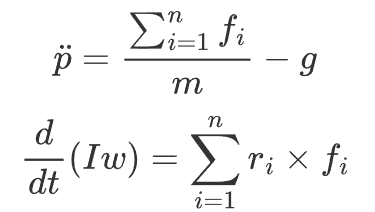
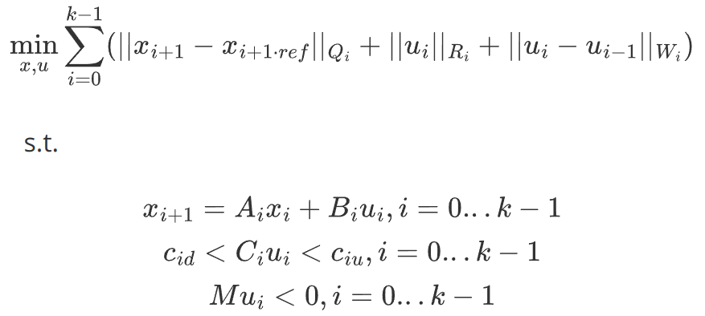
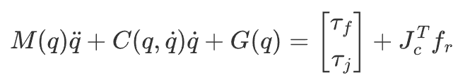
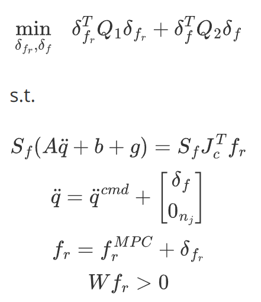

Basic Knowledge
========================================

Model Predictive Control (MPC)
--------------------------------
MPC runs at the low-frequency level, based on a single-rigid-body model by making predictions about the system model 
over a future period of time and generating plantar contact force trajectories based on the current system state 
optimized with the predictions.

The single-rigid-body model of the robot is:

The optimizaiton procedure of MPC is:

Whole Body Control (WBC)
--------------------------------
WBC runs at the high-frequency level, realizing the robot's whole-body multi-joints motion for multi-tasks execution through null-space mapping, 
and ultimately generates position-velocity-torque commands for all the joints based on whole-body dynamics optimization.

WBC adpots a whole body dynamics model, which is:

And the procedure of WBC optimization is:

